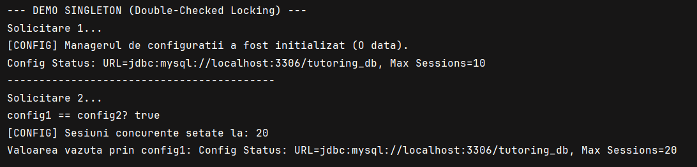
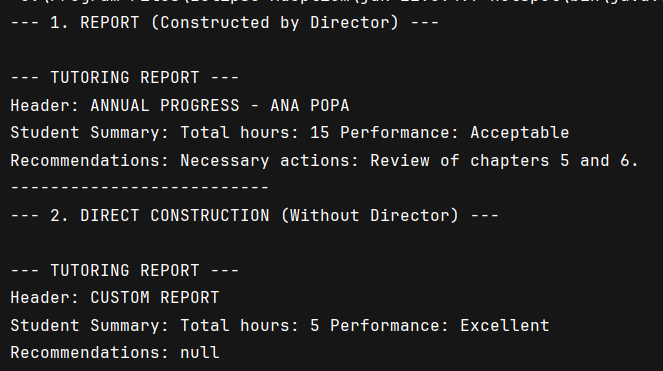

# Creational Design Patterns 

**Author:** Vornicescu Ion

## Objectives:
* Get familiar with Creational Design Patterns;
* Choose a specific domain;
* Implement 3 Creational Design Patterns for the specific domain;

## Domain
The chosen domain is a **Tutoring Management System** that handles tutoring session scheduling, configuration management, and report generation for educational services.

## Implemented Creational Design Patterns:

### 1. Singleton Pattern
### 2. Factory Method Pattern
### 3. Builder Pattern

## Implementation

### Singleton Pattern

The Singleton Pattern ensures that a class has only one instance and provides a global point of access to it. In this implementation, the `TutoringConfig` class manages application-wide configuration settings using the Double-Checked Locking approach for thread safety.

**TutoringConfig.java:**
```java
package lab_2.SingeltonPattern;

public class TutoringConfig {
   
    private static volatile TutoringConfig instance;

    private String databaseUrl;
    private int maxConcurrentSessions;

    private TutoringConfig() {
        this.databaseUrl = "jdbc:mysql://localhost:3306/tutoring_db";
        this.maxConcurrentSessions = 10;
        System.out.println("Configuration manager initialized (Once).");
    }

    public static TutoringConfig getInstance() {
        if (instance == null) {
            synchronized (TutoringConfig.class) {
                if (instance == null) {
                    instance = new TutoringConfig();
                }
            }
        }
        return instance;
    }

    public String getDatabaseUrl() {
        return databaseUrl;
    }

    public void setMaxConcurrentSessions(int maxSessions) {
        this.maxConcurrentSessions = maxSessions;
        System.out.println("Concurrent sessions set to: " + maxSessions);
    }

    public int getMaxConcurrentSessions() {
        return maxConcurrentSessions;
    }

    public void logStatus() {
        System.out.println("Config Status: URL=" + databaseUrl 
            + ", Max Sessions=" + maxConcurrentSessions);
    }
}
```

**SingletonDemo.java:**
```java
package lab_2.SingeltonPattern;

public class SingletonDemo {
    public static void main(String[] args) {
        System.out.println("--- DEMO SINGLETON (Double-Checked Locking) ---");

        System.out.println("Request 1...");
        TutoringConfig config1 = TutoringConfig.getInstance();
        config1.logStatus();

        System.out.println("------------------------------------------");

        System.out.println("Request 2...");
        TutoringConfig config2 = TutoringConfig.getInstance();

        System.out.println("config1 == config2? " + (config1 == config2));

        config2.setMaxConcurrentSessions(20);

        System.out.print("Value seen through config1: ");
        config1.logStatus();
    }
}
```

**Key Features:**
- **Double-Checked Locking**: Minimizes synchronization overhead while ensuring thread safety
- **Volatile keyword**: Prevents instruction reordering and ensures visibility across threads
- **Private constructor**: Prevents external instantiation
- **Global access point**: Single instance accessible throughout the application

### Factory Method Pattern

The Factory Method Pattern defines an interface for creating objects but lets subclasses decide which class to instantiate. In this implementation, the pattern creates different types of tutoring sessions (Standard and Premium) without exposing the instantiation logic.

**TutoringProduct.java (Product Interface):**
```java
package lab_2.FactoryPattern;

public interface TutoringProduct {
    void prepareSession();
    void scheduleTutor(String tutorName);
}
```

**StandardSession.java (Concrete Product):**
```java
package lab_2.FactoryPattern;

public class StandardSession implements TutoringProduct {
    private final String subject;

    public StandardSession(String subject) {
        this.subject = subject;
        System.out.println("  -> Creating Standard Session for " + subject);
    }

    @Override
    public void prepareSession() {
        System.out.println("  -> Standard: Prepare basic materials and virtual room.");
    }

    @Override
    public void scheduleTutor(String tutorName) {
        System.out.println("  -> Standard: Allocate tutor " + tutorName 
            + " with 60-minute duration.");
    }
}
```

**PremiumSession.java (Concrete Product):**
```java
package lab_2.FactoryPattern;

public class PremiumSession implements TutoringProduct {
    private final String subject;

    public PremiumSession(String subject) {
        this.subject = subject;
        System.out.println("  -> Creating PREMIUM Session for " + subject);
    }

    @Override
    public void prepareSession() {
        System.out.println("  -> PREMIUM: Prepare advanced materials, "
            + "recording enabled and dedicated support.");
    }

    @Override
    public void scheduleTutor(String tutorName) {
        System.out.println("  -> PREMIUM: Allocate expert tutor " + tutorName 
            + " with 90-minute duration.");
    }
}
```

**TutoringService.java (Creator):**
```java
package lab_2.FactoryPattern;

public abstract class TutoringService {
    protected abstract TutoringProduct createProduct(String subject);

    public TutoringProduct orderTutoring(String subject, String tutorName) {
        TutoringProduct product = createProduct(subject);
        product.prepareSession();
        product.scheduleTutor(tutorName);
        System.out.println(" Session successfully scheduled.");
        return product;
    }
}
```

**StandardTutoringService.java (Concrete Creator):**
```java
package lab_2.FactoryPattern;

public class StandardTutoringService extends TutoringService {
    @Override
    protected TutoringProduct createProduct(String subject) {
        return new StandardSession(subject);
    }
}
```

**PremiumTutoringService.java (Concrete Creator):**
```java
package lab_2.FactoryPattern;

public class PremiumTutoringService extends TutoringService {
    @Override
    protected TutoringProduct createProduct(String subject) {
        return new PremiumSession(subject);
    }
}
```

**FactoryMethodDemo.java:**
```java
package lab_2.FactoryPattern;

public class FactoryMethodDemo {
    public static void main(String[] args) {
        System.out.println("--- STANDARD SERVICE SCHEDULING ---");
        TutoringService standardService = new StandardTutoringService();
        standardService.orderTutoring("Mathematics", "Mr. Andrei");

        System.out.println("\n====================================");

        System.out.println("--- PREMIUM SERVICE SCHEDULING ---");
        TutoringService premiumService = new PremiumTutoringService();
        premiumService.orderTutoring("Quantum Physics", "Dr. Elena");
    }
}
```

**Key Features:**
- **Encapsulation**: Object creation logic is hidden from client code
- **Extensibility**: New session types can be added without modifying existing code
- **Polymorphism**: Client code works with abstract `TutoringService` interface
- **Template Method**: `orderTutoring()` defines the algorithm structure while delegating object creation

### Builder Pattern

The Builder Pattern separates the construction of a complex object from its representation, allowing the same construction process to create different representations. In this implementation, the pattern constructs detailed tutoring reports with optional components.

**TutoringReport.java (Product):**
```java
package lab_2.BuilderPattern;

public class TutoringReport {
    private String header;
    private String summary;
    private String recommendation;

    public void setHeader(String header) {
        this.header = header;
    }

    public void setSummary(String summary) {
        this.summary = summary;
    }

    public void setRecommendation(String recommendation) {
        this.recommendation = recommendation;
    }

    @Override
    public String toString() {
        return "\n--- TUTORING REPORT ---\n" +
                "Header: " + header + "\n" +
                "Student Summary: " + summary + "\n" +
                "Recommendations: " + recommendation + "\n" +
                "--------------------------";
    }
}
```

**ReportBuilder.java (Builder Interface):**
```java
package lab_2.BuilderPattern;

public interface ReportBuilder {
    void buildHeader(String title);
    void buildStudentSummary(int hours, String performance);
    void buildRecommendations(String recommendations);
    TutoringReport getResult();
}
```

**DetailedReportBuilder.java (Concrete Builder):**
```java
package lab_2.BuilderPattern;

public class DetailedReportBuilder implements ReportBuilder {
    private TutoringReport report;
    
    public DetailedReportBuilder() {
        this.report = new TutoringReport();
    }

    @Override
    public void buildHeader(String title){
        report.setHeader(title.toUpperCase());
    }

    @Override
    public void buildStudentSummary(int hours, String performance) {
        report.setSummary("Total hours: " + hours 
            + " Performance: " + performance);
    }

    @Override
    public void buildRecommendations(String recommendations) {
        report.setRecommendation("Necessary actions: " + recommendations);
    }

    @Override
    public TutoringReport getResult() {
        TutoringReport finalReport = this.report;
        this.report = new TutoringReport();
        return finalReport;
    }
}
```

**ReportDirector.java (Director):**
```java
package lab_2.BuilderPattern;

public class ReportDirector {
    public void constructReport(ReportBuilder builder, String student, 
                                int totalHours) {
        builder.buildHeader("Annual Progress - " + student);
        builder.buildStudentSummary(totalHours, "Acceptable");
        builder.buildRecommendations("Review of chapters 5 and 6.");
    }
}
```

**Main.java:**
```java
package lab_2.BuilderPattern;

public class Main {
    public static void main(String[] args) {
        ReportDirector director = new ReportDirector();

        DetailedReportBuilder detailedBuilder = new DetailedReportBuilder();
        director.constructReport(detailedBuilder, "Ana Popa", 15);
        TutoringReport detailedReport = detailedBuilder.getResult();
        System.out.println("--- 1. REPORT (Constructed by Director) ---");
        System.out.println(detailedReport);

        ReportBuilder directBuilder = new DetailedReportBuilder();
        System.out.println("--- 2. DIRECT CONSTRUCTION (Without Director) ---");
        directBuilder.buildHeader("Custom Report");
        directBuilder.buildStudentSummary(5, "Excellent");
        // no recommendations
        TutoringReport customReport = directBuilder.getResult();
        System.out.println(customReport);
    }
}
```

**Key Features:**
- **Step-by-step construction**: Complex objects built incrementally
- **Flexible construction**: Different representations created using same building process
- **Director optional**: Objects can be built with or without a director
- **Reusability**: Builder can be reused to create multiple objects

## Results

### Singleton Pattern Output:


### Factory Method Pattern Output:


### Builder Pattern Output:


## Conclusions

The implementation of Creational Design Patterns significantly improves the flexibility, maintainability, and scalability of the Tutoring Management System:

1. **Singleton Pattern** ensures centralized configuration management with thread-safe lazy initialization. The Double-Checked Locking approach provides excellent performance while maintaining thread safety, making it ideal for managing shared resources like database connections and system-wide settings.

2. **Factory Method Pattern** provides a flexible framework for creating different types of tutoring sessions without coupling the client code to concrete implementations. This allows easy extension of the system with new session types (e.g., VIP sessions, group sessions) without modifying existing code, adhering to the Open/Closed Principle.

3. **Builder Pattern** separates the construction logic from the representation of complex reports, allowing step-by-step object construction with optional components. The pattern provides excellent control over the construction process and enables the creation of different report variations using the same building mechanism.

These patterns work synergistically to create a robust and flexible system:
- The **Singleton** manages global state efficiently
- The **Factory Method** handles object creation polymorphically
- The **Builder** constructs complex objects systematically

The modular design promotes code reusability, testability, and maintainability. Each pattern addresses specific object creation challenges, resulting in a clean architecture that can easily adapt to evolving business requirements in the educational services domain.