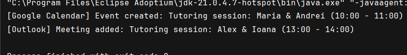
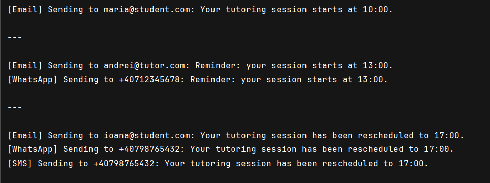
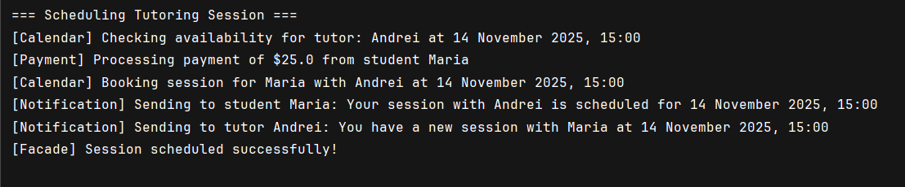

# Structural Design Patterns

**Author:** Vornicescu Ion

## Objectives:
* Get familiar with Structural Design Patterns;
* Choose a specific domain;
* Implement 3 Structural Design Patterns for the specific domain;

## Domain
The chosen domain is a **Tutoring Management System** that handles calendar integration, notification delivery, and session scheduling workflows for educational services.

## Implemented Structural Design Patterns:

### 1. Adapter Pattern
### 2. Decorator Pattern
### 3. Facade Pattern

## Implementation

### Adapter Pattern

The Adapter Pattern converts the interface of a class into another interface that clients expect. It allows classes with incompatible interfaces to work together. In this implementation, the pattern integrates different calendar services (Google Calendar and Outlook) into a unified interface for the tutoring scheduling system.

**ICalendarService.java (Target Interface):**
```java
package adapter;

public interface ICalendarService {
    void addEvent(String startTime, String endTime, String title);
}
```

**GoogleCalendarAPI.java (Adaptee):**
```java
package adapter;

class GoogleCalendarAPI {
    public void createEvent(String title, String start, String end) {
        System.out.println("[Google Calendar] Event created: " + title +
                " (" + start + " - " + end + ")");
    }
}
```

**GoogleCalendarAdapter.java (Adapter):**
```java
package adapter;

public class GoogleCalendarAdapter implements ICalendarService {
    private GoogleCalendarAPI googleApi;

    public GoogleCalendarAdapter() {
        this.googleApi = new GoogleCalendarAPI();
    }

    @Override
    public void addEvent(String startTime, String endTime, String title) {
        googleApi.createEvent(title, startTime, endTime);
    }
}
```

**OutlookCalendarSDK.java (Adaptee):**
```java
package adapter;

class OutlookCalendarSDK {
    public void addMeeting(String subject, String start, String end) {
        System.out.println("[Outlook] Meeting added: " + subject +
                " (" + start + " - " + end + ")");
    }
}
```

**OutlookCalendarAdapter.java (Adapter):**
```java
package adapter;

public class OutlookCalendarAdapter implements ICalendarService {
    private OutlookCalendarSDK outlookSdk;

    public OutlookCalendarAdapter() {
        this.outlookSdk = new OutlookCalendarSDK();
    }

    @Override
    public void addEvent(String startTime, String endTime, String title) {
        outlookSdk.addMeeting(title, startTime, endTime);
    }
}
```

**TutoringScheduler.java (Client):**
```java
package adapter;

public class TutoringScheduler {
    private ICalendarService calendarService;

    public TutoringScheduler(ICalendarService calendarService) {
        this.calendarService = calendarService;
    }

    public void scheduleSession(String tutorName, String studentName, 
                                String start, String end) {
        String title = "Tutoring session: " + tutorName + " & " + studentName;
        calendarService.addEvent(start, end, title);
    }
}
```

**Main.java:**
```java
package adapter;

public class Main {
    public static void main(String[] args) {
        ICalendarService googleCalendar = new GoogleCalendarAdapter();
        ICalendarService outlookCalendar = new OutlookCalendarAdapter();

        TutoringScheduler scheduler1 = new TutoringScheduler(googleCalendar);
        scheduler1.scheduleSession("Maria", "Andrei", "10:00", "11:00");

        TutoringScheduler scheduler2 = new TutoringScheduler(outlookCalendar);
        scheduler2.scheduleSession("Alex", "Ioana", "13:00", "14:00");
    }
}
```

**Key Features:**
- **Interface compatibility**: Converts incompatible calendar APIs into a unified interface
- **Dependency Inversion**: Client depends on abstraction (`ICalendarService`) rather than concrete implementations
- **Extensibility**: New calendar services can be added without modifying existing code
- **Reusability**: Same `TutoringScheduler` works with different calendar providers

### Decorator Pattern

The Decorator Pattern attaches additional responsibilities to an object dynamically. Decorators provide a flexible alternative to subclassing for extending functionality. In this implementation, the pattern adds multiple notification channels (Email, WhatsApp, SMS) to the notification system without modifying the base functionality.

**INotifier.java (Component Interface):**
```java
package decorator;

public interface INotifier {
    void send(String message);
}
```

**EmailNotifier.java (Concrete Component):**
```java
package decorator;

public class EmailNotifier implements INotifier {
    private String userEmail;

    public EmailNotifier(String userEmail) {
        this.userEmail = userEmail;
    }

    @Override
    public void send(String message) {
        System.out.println("[Email] Sending to " + userEmail + ": " + message);
    }
}
```

**NotifierDecorator.java (Base Decorator):**
```java
package decorator;

public abstract class NotifierDecorator implements INotifier {
    protected INotifier wrappee;

    public NotifierDecorator(INotifier notifier) {
        this.wrappee = notifier;
    }

    @Override
    public void send(String message) {
        wrappee.send(message);
    }
}
```

**WhatsAppDecorator.java (Concrete Decorator):**
```java
package decorator;

public class WhatsAppDecorator extends NotifierDecorator {
    private String phoneNumber;

    public WhatsAppDecorator(INotifier notifier, String phoneNumber) {
        super(notifier);
        this.phoneNumber = phoneNumber;
    }

    @Override
    public void send(String message) {
        super.send(message);
        System.out.println("[WhatsApp] Sending to " + phoneNumber + ": " + message);
    }
}
```

**SMSDecorator.java (Concrete Decorator):**
```java
package decorator;

public class SMSDecorator extends NotifierDecorator {
    private String phoneNumber;

    public SMSDecorator(INotifier notifier, String phoneNumber) {
        super(notifier);
        this.phoneNumber = phoneNumber;
    }

    @Override
    public void send(String message) {
        super.send(message);
        System.out.println("[SMS] Sending to " + phoneNumber + ": " + message);
    }
}
```

**Main.java:**
```java
package decorator;

public class Main {
    public static void main(String[] args) {
        // Only Email
        INotifier emailNotifier = new EmailNotifier("maria@student.com");
        emailNotifier.send("Your tutoring session starts at 10:00.");

        System.out.println("\n---\n");

        // Email + WhatsApp
        INotifier whatsappNotifier = new WhatsAppDecorator(
                new EmailNotifier("andrei@tutor.com"),
                "+40712345678"
        );
        whatsappNotifier.send("Reminder: your session starts at 13:00.");

        System.out.println("\n---\n");

        // Email + WhatsApp + SMS
        INotifier fullNotifier = new SMSDecorator(
                new WhatsAppDecorator(
                        new EmailNotifier("ioana@student.com"),
                        "+40798765432"
                ),
                "+40798765432"
        );
        fullNotifier.send("Your tutoring session has been rescheduled to 17:00.");
    }
}
```

**Key Features:**
- **Dynamic composition**: Functionalities added at runtime rather than compile time
- **Single Responsibility Principle**: Each decorator handles one notification channel
- **Flexibility**: Unlimited combinations of notification channels possible
- **Transparent wrapping**: Decorators implement the same interface as the base component

### Facade Pattern

The Facade Pattern provides a unified, simplified interface to a set of interfaces in a subsystem. It defines a higher-level interface that makes the subsystem easier to use. In this implementation, the pattern simplifies the complex process of scheduling a tutoring session by coordinating multiple services.

**CalendarService.java (Subsystem):**
```java
package facade;

public class CalendarService {
    public boolean isTutorAvailable(String tutorName, String dateTime) {
        System.out.println("[Calendar] Checking availability for tutor: " 
            + tutorName + " at " + dateTime);
        return true;
    }

    public void bookSession(String studentName, String tutorName, String dateTime) {
        System.out.println("[Calendar] Booking session for " + studentName 
            + " with " + tutorName + " at " + dateTime);
    }
}
```

**NotificationService.java (Subsystem):**
```java
package facade;

public class NotificationService {
    public void notifyTutor(String tutorName, String message) {
        System.out.println("[Notification] Sending to tutor " + tutorName 
            + ": " + message);
    }

    public void notifyStudent(String studentName, String message) {
        System.out.println("[Notification] Sending to student " + studentName 
            + ": " + message);
    }
}
```

**PaymentService.java (Subsystem):**
```java
package facade;

public class PaymentService {
    public boolean processPayment(String studentName, double amount) {
        System.out.println("[Payment] Processing payment of $" + amount 
            + " from student " + studentName);
        return true;
    }
}
```

**TutoringSessionFacade.java (Facade):**
```java
package facade;

public class TutoringSessionFacade {
    private CalendarService calendarService;
    private NotificationService notificationService;
    private PaymentService paymentService;

    public TutoringSessionFacade() {
        this.calendarService = new CalendarService();
        this.notificationService = new NotificationService();
        this.paymentService = new PaymentService();
    }

    public void scheduleSession(String studentName, String tutorName, 
                                String dateTime, double price) {
        System.out.println("=== Scheduling Tutoring Session ===");

        // 1. Check tutor availability
        if (!calendarService.isTutorAvailable(tutorName, dateTime)) {
            System.out.println("[Facade] Tutor is not available. Cannot schedule session.");
            return;
        }

        // 2. Process payment
        boolean paymentSuccess = paymentService.processPayment(studentName, price);
        if (!paymentSuccess) {
            System.out.println("[Facade] Payment failed. Session not scheduled.");
            return;
        }

        // 3. Book session in calendar
        calendarService.bookSession(studentName, tutorName, dateTime);

        // 4. Send notifications to both parties
        notificationService.notifyStudent(studentName, 
            "Your session with " + tutorName + " is scheduled for " + dateTime);
        notificationService.notifyTutor(tutorName, 
            "You have a new session with " + studentName + " at " + dateTime);

        System.out.println("[Facade] Session scheduled successfully!");
    }
}
```

**Main.java:**
```java
package facade;

public class Main {
    public static void main(String[] args) {
        TutoringSessionFacade tutoringFacade = new TutoringSessionFacade();

        // Client calls only one simple method
        tutoringFacade.scheduleSession(
                "Maria",
                "Andrei",
                "14 November 2025, 15:00",
                25.0
        );
    }
}
```

**Key Features:**
- **Simplified interface**: Complex workflow reduced to single method call
- **Subsystem coordination**: Orchestrates multiple services in correct sequence
- **Loose coupling**: Client code isolated from subsystem complexities
- **Error handling**: Centralized validation and error management

## Results

### Adapter Pattern Output:




### Decorator Pattern Output:



### Facade Pattern Output:



## Conclusions

The implementation of Structural Design Patterns significantly enhances the architecture and maintainability of the Tutoring Management System by improving how classes and objects are composed:

1. **Adapter Pattern** enables seamless integration with external calendar services (Google Calendar and Outlook) without modifying the core scheduling logic. This pattern demonstrates excellent flexibility in integrating third-party APIs with incompatible interfaces, allowing the system to work with any calendar provider through a unified interface. The pattern adheres to the Open/Closed Principle by allowing new calendar integrations without changing existing code.

2. **Decorator Pattern** provides a powerful mechanism for extending notification functionality dynamically. Instead of creating multiple subclasses for different notification combinations, the pattern allows composing notification channels at runtime. This results in a highly flexible system where any combination of Email, WhatsApp, and SMS notifications can be configured without class explosion. The pattern perfectly demonstrates the Single Responsibility Principle, with each decorator handling exactly one concern.

3. **Facade Pattern** dramatically simplifies the client interface by hiding the complexity of coordinating multiple subsystems (Calendar, Payment, and Notification services). The facade reduces a multi-step process involving availability checks, payment processing, booking, and notifications into a single method call. This pattern improves usability, reduces coupling between the client and subsystems, and provides a centralized point for workflow orchestration and error handling.

